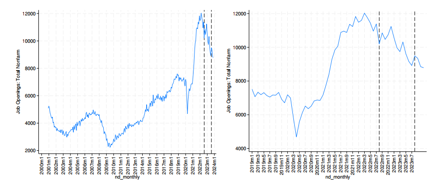
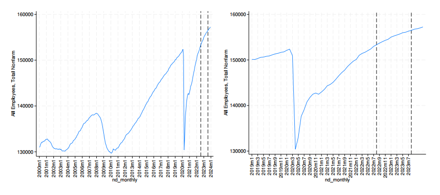

In the summer of 2022, President Biden pushed the Inflation Reduction Act through Congress. Its goal was to promote a transition to clean energy with subsidies for electric cars and solar and wind energy. It also was supposed to raise revenue through a small tax on share buybacks and increased tax enforcement by the Internal Revenue Service. Has the bill succeeded in meeting its goals thus far?

The White House made some claims regarding IRA (which could be read here: [White House IRA Fact Sheet](https://www.whitehouse.gov/briefing-room/statements-releases/2023/08/16/fact-sheet-one-year-in-president-bidens-inflation-reduction-act-is-driving-historic-climate-action-and-investing-in-america-to-create-good-paying-jobs-and-reduce-costs/)).

The brief claims that "Inflation Reduction Act’s clean energy and climate provisions have created more than 170,000 clean energy jobs", which leads to another document here: [Climate Power Report](https://climatepower.us/wp-content/uploads/sites/23/2023/07/Clean-Energy-Boom-Anniversary-Report-1.pdf), which makes the same claim. However, the claim is vague and could not be verified. If read closely, the first paragraph reads, "In just under a year, companies have announced or moved forward with projects accounting for more than 170,600 new clean energy jobs". This is just a projection.

*Figure 1: Nonfarm payroll (in thousands)*
*Note: Source: U.S. Bureau of Labor Statistics, Release: Employment Situation*

The area between the two vertical lines shows the period between the passage of the IRA and one year after that. In a recessional period, businesses and companies often lay off employees or limit hiring due to a decrease in demand for goods and services which results in a negative spike in employment. After a recession, as the economy begins to recover, companies start to increase production and services due to rising demand. This requires more workforce, so firms start to hire more employees leading to a significant increase in employment rates. These jobs are commonly known as the "bounce back jobs". This upsurge often goes above normal as companies not only have to make up for their workforce shortage caused by layoffs during the recession, but they also have to account for increased demand. However, this surge tends to stabilize eventually. That's because once companies have sufficiently increased their workforce to meet the demand at hand, the need for additional hiring decreases. Hence, the employment rate returns to normal levels. This surge was seen during the 2008 financial crisis and also post COVID-19. So, it is clear if there is a surge in non-farm payroll jobs, it is because it is a post-recession recovery period, not because IRA added clean energy jobs.

*Figure 2: Job openings (in thousands)*
*Note: Source: U.S. Bureau of Labor Statistics, Release: Job Openings and Labor Turnover Survey*

If we look at Figure 2, which shows the number of job openings, there has been an aggregate decrease in the number of job openings in the one year after passing of the IRA which raises further questions since when the overall job opening has declined, it is unlikely that just the clean energy jobs were newly added or there was a growth in the clean energy jobs.

Furthermore, according to the U.S. Department of Energy's (DOE) 2023 U.S. Energy and Employment Report (USEER), clean energy added 114,000 jobs nationally, increasing to over 40% of total energy jobs. Thus, there was already a growth trend in clean energy jobs even prior to the passage of the IRA. This pre-existing growth trend indicates that the recovery and addition of energy jobs are more likely a continuation of the sector's bounce back from the pandemic losses rather than a direct consequence of the IRA.
The evidence suggests that the new job growth reported in the clean energy sector could be attributed to the natural recovery from the significant job losses experienced during the pandemic, rather than being directly driven by the IRA. Therefore, the assertion that the IRA is the primary driver of new job creation in the clean energy sector is not strongly supported by the available data.easing to over 40% of total energy jobs. Thus, there was already a growth trend in clean energy jobs even prior to the passage of IRA. It is not clear how much of this trend is contributed by IRA.

### Fallacy of Clean Energy

There is no convincing evidence that the energy being generated is actually clean. There is a big boost for electric vehicles. However, while promoting electric vehicles, a common fallacy is to not look at the source of electricity generation. If electricity generation itself is not through renewable resources, electric vehicles themselves are of no consequence. Another greater concern is humanitarian and pertains to the cobalt used in lithium-ion batteries needed in electric vehicles ([NPR report](https://www.npr.org/sections/goatsandsoda/2023/02/01/1152893248/red-cobalt-congo-drc-mining-siddharth-kara)).

Accounting for the greenhouse gases generated while producing the electricity used in electric vehicles as well as the humanitarian concerns in the cost-benefit analysis of electric vehicles vis-à-vis vehicles using fossil fuels, electric vehicles don't seem to offer a clear-cut competitive advantage as far as clean energy is concerned.

As far as solar energy is concerned, some of the crucial things are overlooked such as the potential negative impacts the solar panels could have such as high upfront and storage costs, changes in land use patterns, intensive water use, disposal of harmful chemicals such as silicon tetrachloride used in the manufacturing process, potential land/soil pollution owing to improper disposal of toxic chemicals and the prospects of recycling the defunct panels or the waste generated.

That leads to another misleading term i.e. chemical recycling, which many environmentalists contend as a misnomer for incineration. It is constantly being touted as "clean energy". However, the [Greenpeace report](https://www.greenpeace.org/usa/news/new-greenpeace-report-plastic-recycling-is-a-dead-end-street-year-after-year-plastic-recycling-declines-even-as-plastic-waste-increases/) as well as the [Beyond Plastics report](https://www.beyondplastics.org/publications/chemical-recycling) point out the fallacies in considering the so-called "clean energy technologies" as clean.

### Heat Pumps vs. Gas Boilers

There is another area where boost is given i.e. the heat pumps. For approximately 1 kg of natural gas, you can generate 0.0217 GJ of electric energy and about 3.02 kg of CO2 will be released.

From 1 kg of natural gas, a heat pump will generate \(0.0217 \text{ GJ} \times 3 = 0.0651 \text{ GJ}\) of heat for a home since they have 300% efficiency rating, while 3.02 kg of CO2 is released. So, the emission per unit consumed is:
\[ \frac{3.02 \text{ kg CO2}}{0.0651 \text{ GJ}} \approx 46.39 \text{ kg CO2/GJ of heat} \]

By burning 1 kg of natural gas, you would generate approximately 0.0536 GJ (or 53.6 MJ) of thermal energy. Thus, for 1 kg of natural gas burned, about 3.0 kg of CO2 is released.

So, from 1 kg of natural gas, a gas boiler would produce 0.0536 GJ of heat, and 3.0 kg of CO2 is released:
\[ \frac{3.0 \text{ kg CO2}}{0.0536 \text{ GJ}} \approx 56.01 \text{ kg CO2/GJ of heat} \]

These are only tentative calculations. This is assuming that the heat pump is indeed operating at full efficiency and not considering transmission losses. There is absolutely no evidence that heat pumps are cleaner and more efficient overall than gas boilers. The moral of the story is that the technologies being touted as clean are not necessarily clean.

### Wind Energy Concerns

While wind energy has been touted as a green, renewable alternative to fossil fuels, it is not without a set of associated drawbacks. Firstly, one major concern with wind energy is its inconsistent and unreliable nature. Wind farms are only able to generate power when the wind is blowing at an adequate speed, which makes them less reliable than more traditional sources of energy. It necessitates the need for alternative backup systems for when wind power generation is not possible. Secondly, the infrastructure required for wind power, including wind turbines, can cause significant noise and visual disturbances. These turbines are a source of concern for many communities because of their impact on the local scenery and the potential for noise pollution. Thirdly, they require substantial land space for installation. This often leads to the destruction of natural habitats during the construction of the wind farms which negatively impacts biodiversity. Moreover, wind turbines can pose an existential threat to flying wildlife, particularly birds and bats. Many of these creatures are killed every year by colliding with the spinning turbine blades. Lastly, from an economic perspective, the high initial costs for installation and maintenance pose a significant challenge. The capital costs of wind turbines are quite high, and the long-term maintenance costs can make them unattractive investments without robust long-term government subsidies. While mitigation strategies exist for each of these drawbacks, integration of wind energy into the power grid should be done thoughtfully to minimize these negative impacts.

### The Subsidy Dilemma

There exists a significant amount of monetary resources, derived from taxpayer contributions, funneled into propelling the so-called "clean energy" technologies. This strategy ostensibly serves the dual purpose of job creation, including the promotion of clean jobs in particular instances. Notably, the magnitude of the subsidies and tax credits or rebates received by corporations can be observed vis-à-vis [Subsidy Tracker](https://subsidytracker.goodjobsfirst.org). However, it is imperative to highlight that the premise of clean energy and technology is often not substantiated, and the job creation promises remain unfulfilled. Furthermore, there is an apparent disregard for the Environmental Protection Agency’s guidelines. A comprehensive cost-benefit analysis reveals a rather bleak picture. The enormous subsidy and tax credit influx, including the ones given by IRA, appears untenable when placed against the background of the initial objectives purportedly set out to be achieved by this strategy. It's clear there is a discernible disconnection between the envisioned expectations and the actual outcomes.

This brings us to the second major purported objective i.e. tax on share buyback and increased enforcement. Firstly, the huge amount of subsidies and tax credits on the so-called clean energy which not be clean, defeats the two purported objectives mentioned above, without even achieving the desired objective of implementing clean energy. According to tax foundation's report here ([Tax Foundation Report](https://taxfoundation.org/research/all/federal/inflation-reduction-act-taxes/)), these provisions of IRA have extraordinary implementation challenges and taxpayer confusion and has worsened deficits. Thus, the bill suffered from its improperly defined goals, despite the purported good intentions. More data based evidence is needed just to define the correct goals. That is the first step before comprehensive solutions are suggested.
